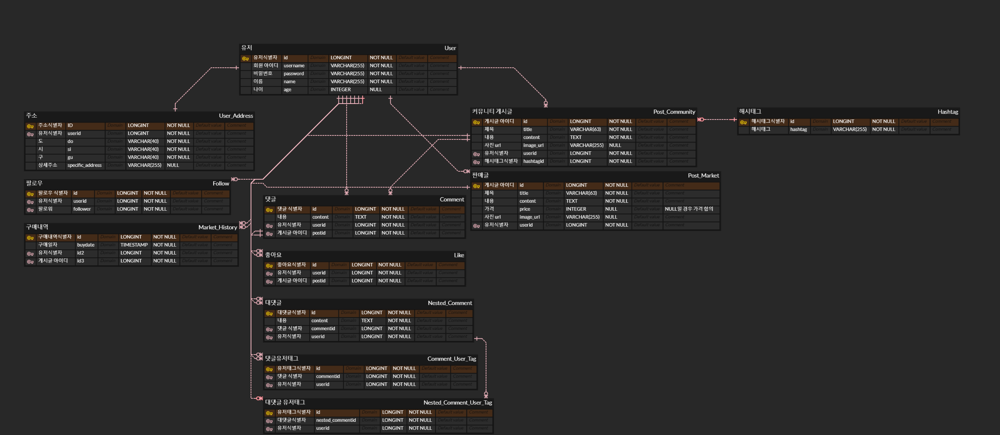

## DB 구조 짜기

ERD CLOUD 링크
https://www.erdcloud.com/d/H6bWowaaWreDeWjHT



## DB 구현

- nested model의 폼 입력, ManyToMany 구현
    - nested model: 모델 안에 모델이 삽입된 구조 (User 안에 Address)
    - ManyToMany: 다대다 관계 (팔로우)
        - 실무에서 다대다 관계는 사용 지양
        - 관계형 데이터베이스를 사용할 경우 표현이 불가능함. → 일대다/다대다로 풀어서 표현
    - superuser 생성 시 오류가 발생할 수 있음. → 생성 시 market/models[.py](http://views.py) 다음과 같이 변경 후 migration 적용
    
    ```jsx
    class User(AbstractUser):
        first_name = None
        last_name = None
        username = models.CharField(max_length=10, unique=True)
        name = models.CharField(max_length=10, null=True, blank=True)
        age = models.IntegerField(null=True, blank=True)
        address = models.ForeignKey(Address, on_delete = models.CASCADE, null=True, blank=True)
        following = models.ManyToManyField('self', symmetrical=False, related_name='follower', null=True, blank=True)
    ```
    
- nested model의 폼 입력
    - form.as_p는 두 모델(user, address)에 대해 각각 적용해야 함.
        - form.as_p를 사용하면 is_valid를 사용할 수 있어 편함.
        - 최대한 분리하지 않는 방향으로 설계
    - address 데이터를 user 안에 삽입하여 저장
- ManyToMany 구현
    - 팔로우 기능 구현할 때 ManyToMany 사용
        - 현재 팔로워, 팔로잉 확인 기능 구현
        - 전체 유저에 대해 팔로잉 또는 팔로잉 취소 기능 구현
    - 만약 일대다/다대다로 변형한다면 nested model의 꼴을 가지도록 변경해야 할 것으로 보임.
    
    ```jsx
    following = models.ManyToManyField('self', symmetrical=False, related_name='follower', null=True, blank=True)
    ```
    
    - symmetrical: (A, B) = (B, A) in True
    - related_name: UserA → UserB 관계에서 A는 B에게 follower, B는 A에게 follwing 상태임을 나타냄. 둘이 겹쳐지면 error 발생
